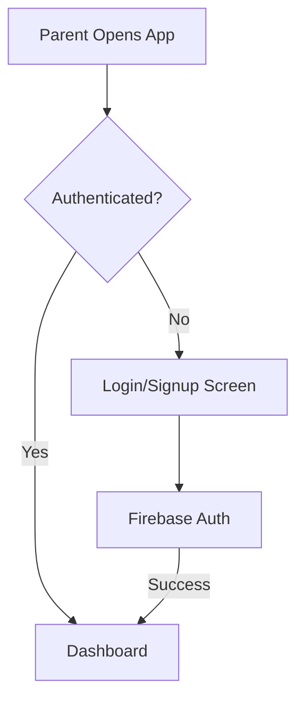
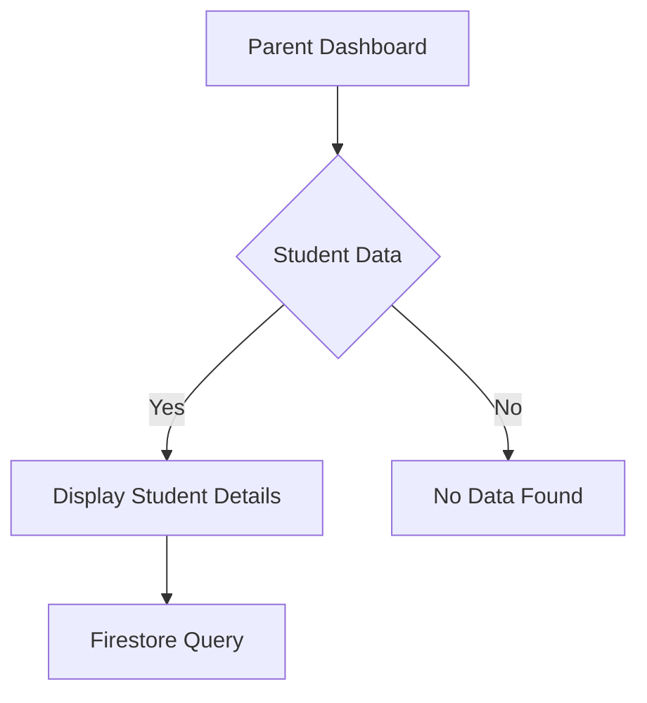
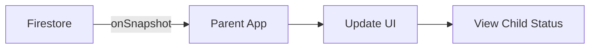

# STEM ATTENDANCE APP (PARENT)

The Attendance App (for parent) is a mobile application designed for parents to monitor their children's attendance. Built using **Expo** and **React Native**, the app integrates with **Firebase** for authentication and **Firestore** for real-time data updates.


  


<!-- Rainbow Divider -->
<div align="center">
  
</div>

## 🔥 Key Features

| Feature                    | Description                                               |
| -------------------------- | --------------------------------------------------------- |
| **Authentication 🔐**      | Login and Signup functionality using Firebase.            |
| **Dynamic Greetings 🌍**   | Greetings in multiple languages based on time of the day. |
| **Real-Time Updates 🔄**   | Real-time data updates using Firebase Firestore.          |
| **Navigation System 🧭**   | Navigation between screens using Expo Router.             |
| **QR Code Access 🖼️**      | View the QR Code of a child within the app.               |
| **Beautiful UI 🎨**        | Safe Area View and Flexbox for responsive design.         |
| **User Management 👥**     | Profile retrieval and sign out functionality.             |
| **Reusable Components ♻️** | Custom components for forms, buttons, and more.           |

---

## 🛠️ How It Works

### 🔐 Authentication



- Parents can login or signup using their email and password.
- Only parents with email registered in Firestore can create accounts.
- The authentication state is observed using `onAuthStateChanged`, redirecting the parents accordingly.

### 📊 Student Data Handling



- Student details are fetched from Firestore based on the parent's account using `onSnapshot`.
- Data is displayed in real-time and updated immediately when changes are made.
- Parents can view their child's profile dynamically.

**🔀 Real-Time Data Flow**



### 🧭 Navigation

- The app uses **expo-router** for seamless navigation.
- Screens are dynamically loaded based on user interaction.

## 🧰 Tech Stack

### 📱 Core Dependencies

| Package        | Description             |
| -------------- | ----------------------- |
| `react-native` | Core framework          |
| `expo`         | Development environment |
| `expo-router`  | Navigation system       |
| `firebase`     | Firebase integration    |

### 🎨 Styling & UI

| Package                          | Description               |
| -------------------------------- | ------------------------- |
| `nativewind tailwind`            | Tailwind CSS for styling  |
| `react-native-safe-area-context` | Ensures safe UI placement |
| `expo-linear-gradient`           | Gradient backgrounds      |
| `react-native-modal`             | Custom Modal Support      |
| `@expo/vector-icons`             | Icon support              |
| `react-native-dropdown-picker`   | Dropdown Support          |

```bash
npm install nativewind tailwind react-native-safe-area-context expo-linear-gradient react-native-modal @expo/vector-icons react-native-dropdown-picker
```

## 📂 Folder Structure

```
/parent-app
│── .expo/                   # Expo development files 🛠️
│── app/                     # Main application code
│   ├── components/          # Reusable components (e.g., AuthTabs, FormInput, etc.) 🧩
│   ├── constants/           # Application constants (e.g., routes, etc.) 🚗
│   ├── hooks/               # Custom hooks (e.g., useAuth, useStudents) ⚓
│   ├── screens/             # Application screens (e.g., HomeScreen, AuthScreen, etc.) 🖥️
│   ├── utils/               # Utility functions (e.g., formatDate, etc.) 🛠️
│   ├── globals.css          # Tailwind CSS global styles 🎨
│   ├── _layout.tsx          # Root layout and navigation setup 🌐
│   └── index.tsx            # Main entry point ⚡
│── assets/                  # Static assets (e.g., images, icons) 🖼️
│── node_modules/            # Project dependencies 📦
│── .gitignore               # Files and folders to ignore in Git 🚫
│── FirebaseConfig.ts        # Firebase configuration 🔥
│── metro.config.js          # Metro bundler configuration 🚚
│── babel.config.js          # Babel configuration 🎨
│── package.json             # Project dependencies and scripts 📦
│── tailwind.config.js       # Tailwind CSS configuration 🎨
```

## 🚀 Possible Improvements

- **Push Notifications 🔔** - Notify parents about attendance updates.
- **Dark Theme 🌙** - Allow the parents to choose between light and dark mode.
- **Multi-Language Support 🌐** - Add more languages for the entire app.
- **Feedback System 💬** - Allow parents to provide feedback or report issues.
- **Performance Optimizations ⚡** - Reduce re-renders and optimize Firestore queries.

## 🛠️ Installation & Setup

### 1️⃣ Prerequisites

Before starting, ensure you have the following installed:

- **Node.js** (Recommended: LTS version) ➜ Download here: [Node.js](https://nodejs.org/)
- **Expo CLI** ➜ Install globally using:
  ```bash
  npm install -g expo-cli
  ```
- **Firebase Project** ➜ Create one at [Firebase Console](https://console.firebase.google.com/)

### 2️⃣ Install Dependencies

Navigate to the `parent-app` folder and install the required dependencies:

```bash
npm install
```

Install additional dependencies:

```bash
npm install nativewind tailwindcss react-native-safe-area-context react-native-reanimated expo-linear-gradient firebase react-native-dropdown-picker
```

### 3️⃣ Firebase Setup

1. Create a **FirebaseConfig.ts** file inside the `parent-app` if it doesn't exist.
2. Add your Firebase configuration:

```bash
import { initializeApp } from "firebase/app";
import { initializeAuth, getReactNativePersistence } from "firebase/auth";
import AsyncStorage from "@react-native-async-storage/async-storage";
import { getFirestore } from "firebase/firestore";

const firebaseConfig = {
  apiKey: <"API_KEY">,
  authDomain: <"AUTH_DOMAIN">,
  projectId: <"PROJECT_ID">,
  storageBucket: <"STORAGE_BUCKET">,
  messagingSenderId: <"MESSAGING_SENDER_ID">,
  appId: <"APP_ID">,
  measurementId: <"MEASUREMENT_ID">,
  };

const app = initializeApp(firebaseConfig);

const auth = initializeAuth(app, {
  persistence: getReactNativePersistence(AsyncStorage),
});

const db = getFirestore(app);

export { app, auth, db };
```

3. Replace the placeholders (`<API_KEY>`, `<AUTH_DOMAIN>`, etc.) with your Firebase project credentials.

### 4️⃣ Start the App

Run the Expo development server:

```bash
npx expo start
```

▶ Scan QR with Expo Go App

## 🚀 Deployment

Once the app is stable, you can build using standalone versions:

```bash
expo build:android
expo build:ios
```
