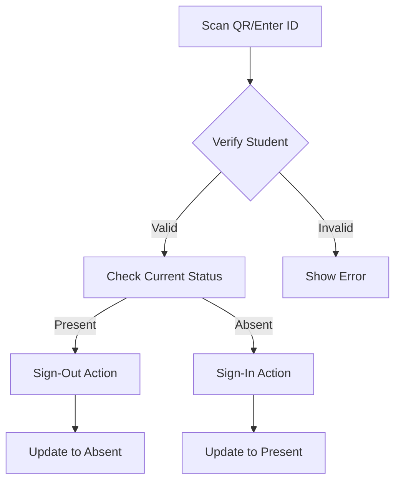
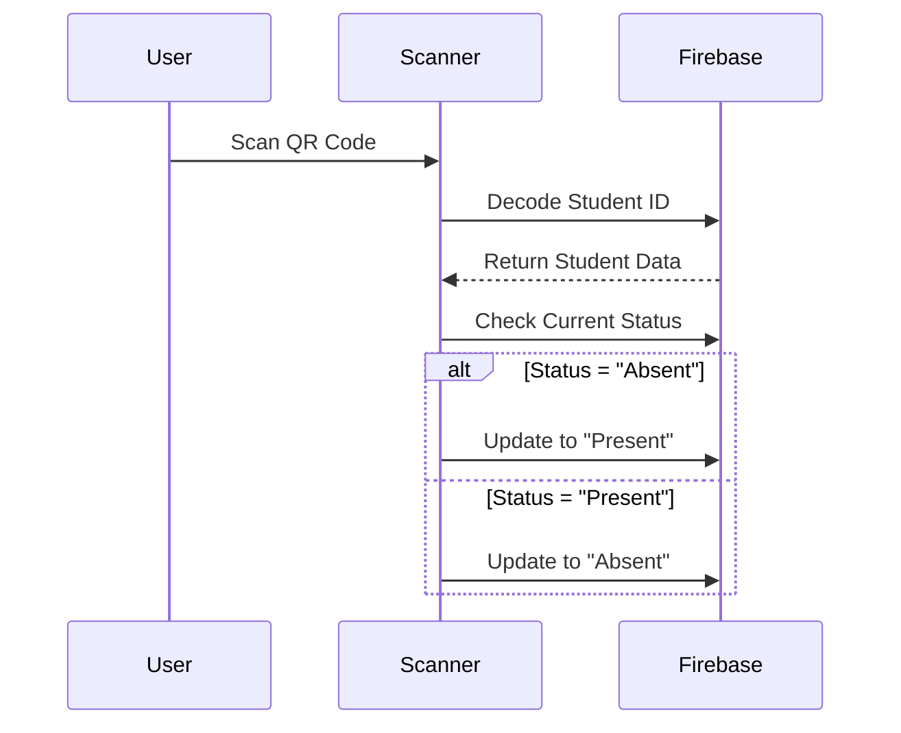
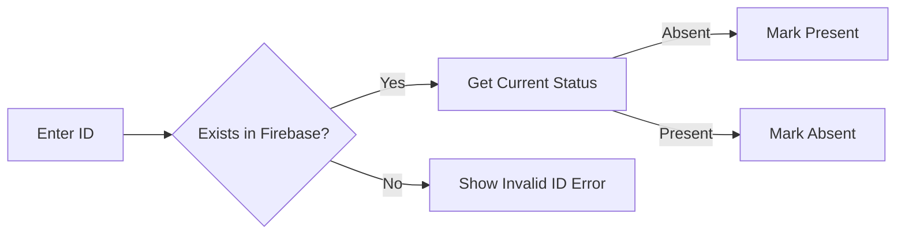

# STEM ATTENDANCE APP (SCANNER)

**_STEM Scanner_** is a mobile application designed for teachers or authorized indivuals to scan student QR codes and mark attendance. Built using **Expo** and **React Native**, the app integrates with **Firebase** for real-time database management. It provides a seamless and efficient way update student attendance status using QR Codes (or Student ID).


<!-- Animated Divider -->
<div align="center">
  
</div>

## 🌟 Key Features

| Feature                        | Description                            |
| ------------------------------ | -------------------------------------- |
| **Lightning-Fast Scanning ⚡** | Scan student QR codes in a snap!       |
| **Dynamic Greetings 🌍**       | Greetings in 3 languages based on time |
| **Real-Time Updates 🔄**       | Sync attendance data instantly         |
| **Beautiful UI 🎨**            | Modern design with Tailwind CSS        |
| **Reusable Components ♻️**     | Modular components for easy reuse      |

## 📊 Attendance Workflow



## ✨ Feature Highlights

| Feature                   | Description                                                                 |
| ------------------------- | --------------------------------------------------------------------------- |
| **Dual Input Methods**    | Scan QR codes or manually enter student IDs                                 |
| **Smart Status Toggling** | Auto-toggles between Present/Absent based on current status and action type |
| **Real-Time Validation**  | Instant verification against Firebase database                              |

## 🧰 Tech Stack

### 📱 Core Dependencies

| Package        | Description            |
| -------------- | ---------------------- |
| `react-native` | Core framework         |
| `expo`         | React Native framework |
| `firebase`     | Realtime database      |

### 🎨 Styling & UI

| Package                          | Description               |
| -------------------------------- | ------------------------- |
| `nativewind tailwind`            | Tailwind CSS for styling  |
| `react-native-safe-area-context` | Ensures safe UI placement |
| `expo-linear-gradient`           | Gradient backgrounds      |

```bash
npm install nativewind tailwindcss react-native-safe-area-context expo-linear-gradient
```

### 📷 Camera & Scanning

| Package           | Description                                           |
| ----------------- | ----------------------------------------------------- |
| `expo-camera`     | Camera access for scanning QR codes                   |
| `expo-dev-client` | Expo development client (only for testing CameraView) |

```bash
npm install expo-camera
```

### 🗃️ Data Management

| Package                                     | Description               |
| ------------------------------------------- | ------------------------- |
| `firebase`                                  | Firebase SDK for database |
| `@react-native-async-storage/async-storage` | Asynchronous storage      |

```bash
npm install firebase @react-native-async-storage/async-storage
```

### 🚀 Navigation & Animation

| Package                                       | Description                               |
| --------------------------------------------- | ----------------------------------------- |
| `@react-navigation/native`                    | Navigation library                        |
| `@react-navigation/core react-native-screens` | Required for React navigation to function |
| `react-native-reanimated`                     | Animated transitions                      |

```bash
npm install @react-navigation/native @react-navigation/core react-native-screens react-native-reanimated
```

## 📂 Folder Structure

```
/scanner-app
│── .expo/                   # Expo development files 🛠️
│── app/                     # Main application code
│   ├── components/          # Reuasble react components (e.g. buttons, modals) 🧩
│   │    ├── buttons/        # Custom buttons (e.g. FunctionButtons, etc.) 🛍️
│   │    ├── modals/         # Modal components (e.g. MenuModal, StudentIDModal, etc.) 📦
│   │    └── ui/             # UI components (e.g. Header, CameraOverlay, etc.) 🎨
│   ├── constants/           # Application constants (e.g. routes, greetings) 📊
│   ├── hooks/               # Custom hooks (e.g. useCamera, useQRScanner, etc.) 🎣
│   ├── screens/             # Application screens (e.g. HomeScreen, ScanScreen) 🖥️
│   ├── globals.css          # Tailwind CSS global styles 🎨
│   ├── _layout.tsx          # Root layout and navigation setup 🌐
│   └── index.tsx            # Main entry point ⚡
│── assets/                  # Static assets (e.g., images, icons) 🖼️
│── node_modules/            # Project dependencies 📦
│── .gitignore               # Files and folders to ignore in Git 🚫
│── FirebaseConfig.ts        # Firebase configuration 🔥
│── metro.config.js          # Metro bundler configuration 🚚
│── babel.config.js          # Babel configuration 🎨
│── package.json             # Project dependencies and scripts 📦
│── tailwind.config.js       # Tailwind CSS configuration 🎨
```

## 🔄 Attendance Logic Flow

### QR Code Processing



### Manual ID Processing



## 🛠️ Installation & Setup

### 1️⃣ Prerequisites

Before starting, ensure you have the following installed:

- **Node.js** (Recommended: LTS version) ➜ Download here: [Node.js](https://nodejs.org/)
- **Expo CLI** ➜ Install globally using:
  ```bash
  npm install -g expo-cli
  ```

- **Firebase Project** ➜ Create one at [Firebase Console](https://console.firebase.google.com/)

### 2️⃣ Install Dependencies

Navigate to the `scanner-app` folder and install the required dependencies:

```bash
npm install
```

Install additional dependencies:

```bash
npm install nativewind tailwindcss react-native-safe-area-context react-native-reanimated expo-linear-gradient expo-camera firebase @react-navigation/native @react-navigation/core react-native-screens @react-native-async-storage/async-storage
```

### 3️⃣ Firebase Setup

1. Create a **FirebaseConfig.js** file inside the `scanner-app` if it doesn't exist.
2. Add your Firebase configuration:

```ts
import { initializeApp } from "firebase/app";
import { getFirestore } from "firebase/firestore";

const firebaseConfig = {
  apiKey: <"API_KEY">,
  authDomain: <"AUTH_DOMAIN">,
  projectId: <"PROJECT_ID">,
  storageBucket: <"STORAGE_BUCKET">,
  messagingSenderId: <"MESSAGING_SENDER_ID">,
  appId: <"APP_ID">,
  measurementId: <"MEASUREMENT_ID">,
};

const app = initializeApp(firebaseConfig);
const db = getFirestore(app);

export { app, db };
```

3. Replace the placeholders (`<API_KEY>`, `<AUTH_DOMAIN>`, etc.) with your Firebase project credentials.

### 4️⃣ Start the App

Run the Expo development server:

```bash
npx expo start
```

**▶ Scan QR with Expo Go App**

## 📝 Notes

- 📷 Ensure the device has a working camera for QR code scanning.
- 🔥 Firebase configuration is required for database functionality.
- 📱 The app is optimized for both **Android** and **iOS** platforms.
